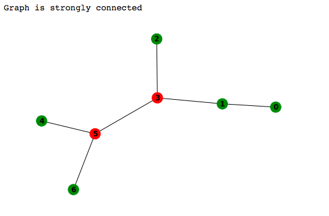

## Instruction
Need to install python 3, pip 3 [virtualenv]
Clone/Download repository 

`git clone https://github.com/bat9r/graph_lpnu_research.git`

Install requirements

` pip3 install -r requirements.txt `

Run Jupyter notebook

` jupyter notebook --port 8888`

Open in browser

` localhost:8888 `

Open file Strongly_connected_graph.ipynb

## Example of using

